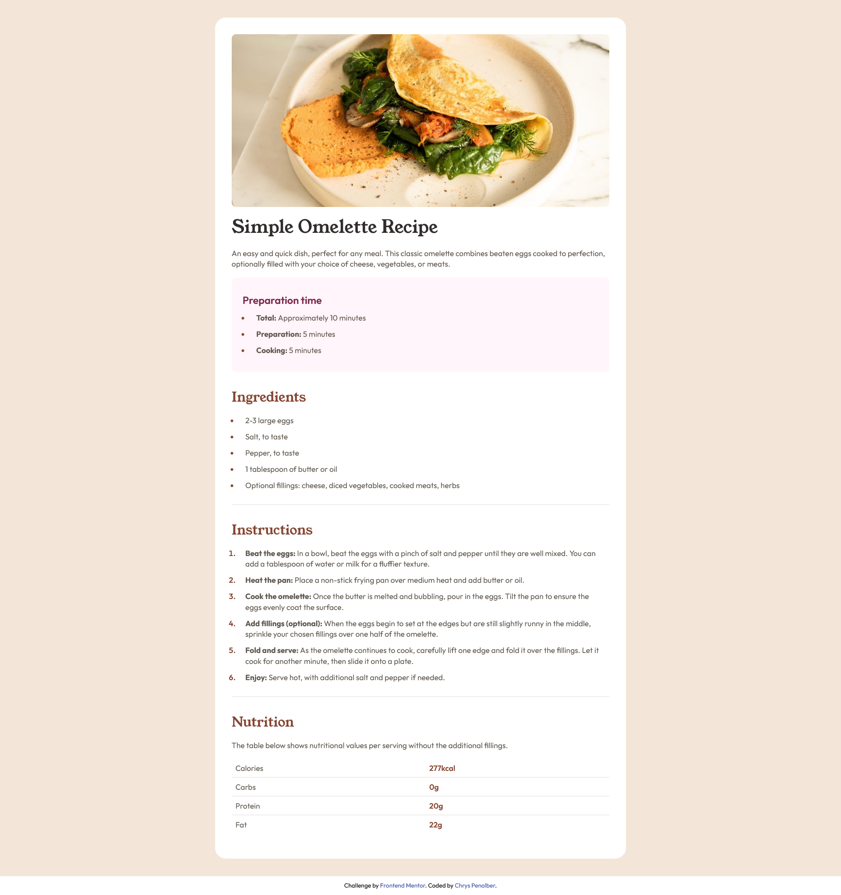

### Frontend Mentor - Recipe Page Solution

This is a solution to the [Recipe page challenge on Frontend Mentor](https://www.frontendmentor.io/challenges/recipe-page-KiTsR8QQKm).

## Table of Contents

- [Overview](#overview)
  - [Screenshot](#screenshot)
  - [Links](#links)
- [My Process](#my-process)
  - [Built With](#built-with)
  - [What I Learned](#what-i-learned)
  - [Continued Development](#continued-development)
  - [Useful Resources](#useful-resources)
- [Author](#author)

## Overview

This is a simple recipe page built using semantic HTML and CSS. It is a structured and accessible solution for displaying a recipe with ingredients, instructions, and nutritional information.

### Screenshot



### Links

- [Solution URL](https://github.com/chryspenalber/recipe-page)
- [Live Site](https://chryspenalber.github.io/recipe-page/)

## My Process

My process for creating this solution began with the use of semantic HTML, ensuring a clean and structured codebase by applying the appropriate tags according to semantic HTML principles. Next, I wrote the CSS following the guidelines outlined in the proposed challenge. Finally, I adapted the CSS to ensure responsiveness for smaller screens.

### Built With

- Semantic HTML5
- CSS custom properties

**Semantic HTML Tags Used:**

```html
<!DOCTYPE html>
<html>
<head>
<meta>
<title>
<link>
<footer>
<body>
<header>
<main>
<section>
<h1>
<h2>
<h3>
<p>
<ul>
<ol>
<li>
<b>

<table>
<tr>
<td>
```

**CSS Features:**

- **@import:** The `@import` rule in CSS allows you to import external fonts, such as from Google Fonts, via a link in your style sheet.
- **Selectors:**
  - `*`: Selects all elements.
  - `#id`: Selects an element by its ID.
  - `.class`: Selects elements by their class.
- **Pseudo-elements:**
  - `::marker`: Selects the markers of list items.
- **Pseudo-classes:**
  - `:first-child` and `:last-child`: Match a specified element that is the first or last child of another element.
  - `:first-of-type`, `:last-of-type`: Select the first or last element of its type among a group of sibling elements.
  - `:hover`: Selects the element on mouse over.
  - `:not()`: Selects any element that is not the element specified in the parentheses.

### What I Learned

This project reinforced the importance of semantic HTML in effectively structuring content. I also applied CSS best practices to style the page in a clean and accessible way.

### Continued Development

My short-term goal is to create web pages using semantic HTML and advanced CSS techniques to enhance structure and responsiveness.

### Useful Resources

- [MDN Web Docs - Semantic HTML](https://developer.mozilla.org/en-US/docs/Glossary/Semantics) - This guide helped me understand the importance of semantic elements.

## Author

- GitHub - [Chrys Penalber](https://github.com/chryspenalber)
- Frontend Mentor - [@chryspenalber](https://www.frontendmentor.io/profile/chryspenalber)
